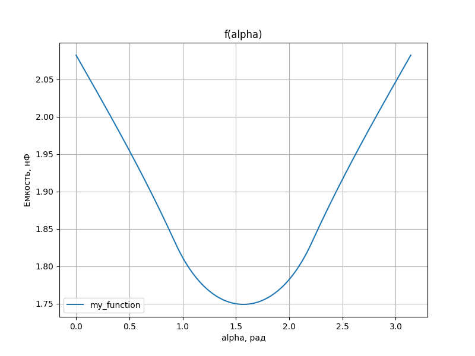
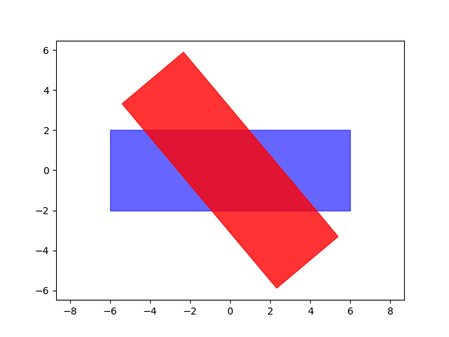
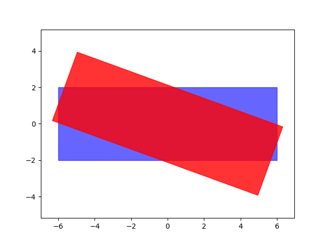

<h1 align="center">Phisycs.Capacitor </a> 
<h2 align="center">Modeling №2</h2>

<h3 align="center">Task 1</h3>

  

<h3 align="center">Task 2</h3>
<h4 align="center">F(a) </h4>

  

<h4 align="center">subtask</h4>
<h5 align="center">Intersection Areas</h5>
<h6 align="center">Default:</h6>

  

<h6 align="center">X Case:</h6>

  

[Формулы для расчета Силовых и Эквипотенциальных линий при краевом эффекте](Краевой%20эффект.pdf)

@Clawf
